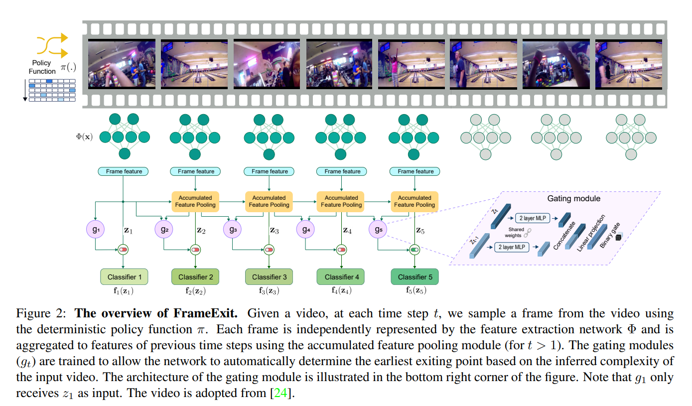
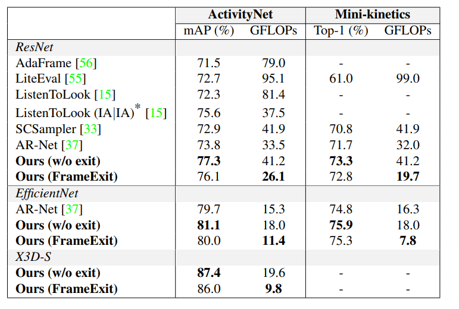
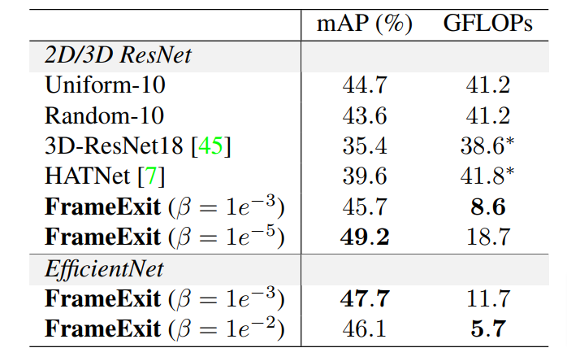
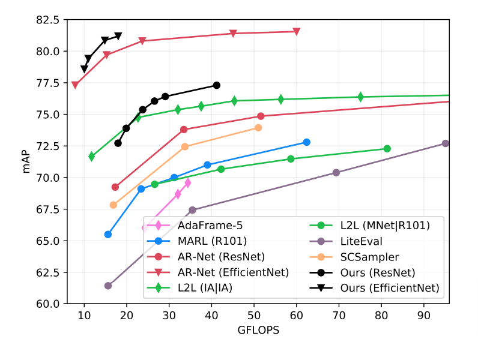

# FrameExit

The inference code for FrameExit paper presented in CVPR 2021 (oral paper).

**[Amir Ghodrati](https://aghodrati.github.io/)<sup>\*,1</sup>, [Babak Ehteshami Bejnordi](http://www.babakint.com/)<sup>\*,1</sup>, [Amirhossein Habibian](https://habibian.github.io/)<sup>1</sup>, "FrameExit: Conditional Early Exiting for Efficient Video Recognition", CVPR 2021** [[arxiv]](https://arxiv.org/abs/2104.13400).

<sup>*</sup> Equal contribution

<sup>1</sup> Qualcomm AI Research (Qualcomm AI Research is an initiative of Qualcomm Technologies, Inc)

## Reference
If you find our work useful for your research, please cite:
```latex
@inproceedings{ghodrati2021,
  title={FrameExit: Conditional Early Exiting for Efficient Video Recognition},
  author={Ghodrati, Amir and Bejnordi, Babak Ehteshami and Habibian, Amirhossein},
  booktitle={Proceedings of the IEEE Conference on Computer Vision and Pattern Recognition},
  year={2021}
}
```

## Method


# Install

This repository has been tested in Ubuntu 16.04 and Cuda 10. Clone this repository and follow these steps:
```bash
conda create -n frameexit python=3.6
conda activate frameexit
conda install pytorch=1.3.1 torchvision=0.4.2 pillow pyyaml
pip install fire==0.3.1 pytorch-ignite==0.3.0
```

# Pretrained models
Our pretrained models can be downloaded from here and should be placed inside the directory `resources/checkpoints`:

[activitynet_checkpoint_25gmac.pth](https://github.com/Qualcomm-AI-research/FrameExit/releases/download/v1.0/activitynet_checkpoint_25gmac.pth)

[minikinetics_checkpoint_19.7gmac.pth](https://github.com/Qualcomm-AI-research/FrameExit/releases/download/v1.0/minikinetics_checkpoint_19.7gmac.pth)

# Evaluation
To get help:
```
python3.6 inference.py config/activitynet_inference_2d.yml --help
```

To get the results on ActivityNet1.3, run the following command:
```
python3.6 inference.py config/activitynet_inference_2d.yml --data.path_frame <path/to/activitynet/frames> --checkpoint.init <path/to/activitynet/model>
```
For Mini-Kinetics:
```
python3.6 inference.py config/minikinetics_inference_2d.yml --data.path_frame <path/to/minikinetics/frames> --checkpoint.init <path/to/minikinetics/model>
```
where `<path/to/.../frames>` is the path to the extracted frames, and `<path/to/.../model>` points to the model file.

# Results
After running the above commands, the results should look like:

|    *Name*         |*mAP*|*Top-1 Acc*|*GFLOPs*|
|:-------------:|:--------:|:----------:|:-----------:|
| ActivityNet   |  0.7612  |    -    |    24.7   |
| Mini-Kinetics |   -   |   0.7331  |   19.7   |

Please note that the results could be slightly different as some videos in the validation set may no longer be available.

In our paper, in addition to Resnet-50, we report the results using the Efficientnet-B3 and X3D-S backbones (Left table). We also report results on the HVU dataset (Right table):
<table border="0">
<tr>
    <td>
    
    </td>
    <td>
    
    </td>
</tr>
</table>

The accuracy vs. efficiency curves on ActivityNet is shown below:


To reproduce the curves for FrameExit (in black), we use the following data points:
```
Gflops_resnet50_FrameExit = [17.96, 19.89,  23.78, 26.56, 29.09, 41.2]
map_resnet50_FrameExit = [72.72, 73.90, 75.37, 76.05, 76.41, 77.30]

Gflops_efficientnet_FrameExit = [10.03, 10.98, 14.85, 18.00]
map_efficientnet_FrameExit = [78.57, 79.41, 80.85, 81.18]
``` 
